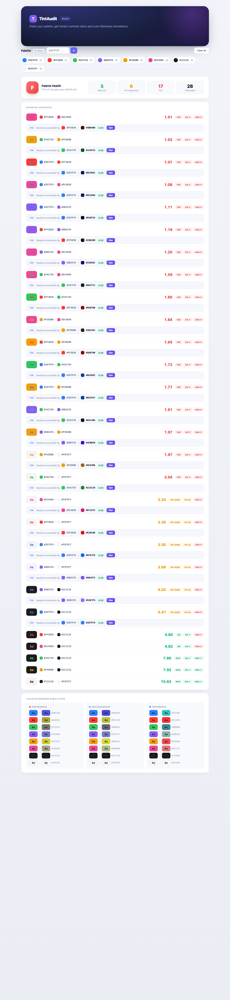

<p align="center">
  
  
  
  
  
</p>

<h1 align="center">
  🎨 TintAudit
</h1>

<p align="center">
  <b>A browser-based palette accessibility auditor</b><br>
  <i>Paste a palette · Check contrast · Find fixes · Simulate color blindness — all in your browser, no server needed.</i>
</p>

<br>

---

<br>

## ✨ Features

<table>
  <tr>
    <td width="33%" align="center">
      <h3>📋 Paste a Palette</h3>
      <p>Drop in hex colors (one per line or comma-separated) with live swatch preview as you type</p>
    </td>
    <td width="33%" align="center">
      <h3>🧭 Palette Health</h3>
      <p>Instant A–F grade plus pass / warn / fail counts across every color pair</p>
    </td>
    <td width="33%" align="center">
      <h3>👫 Pairwise Contrast</h3>
      <p>Worst-first list with live "Aa" previews, exact ratios, and AA/AAA badges</p>
    </td>
  </tr>
  <tr>
    <td width="33%" align="center">
      <h3>🛠️ Nearest Fix</h3>
      <p>One-click nearest accessible alternative for any failing pair, with a Use button to apply it</p>
    </td>
    <td width="33%" align="center">
      <h3>👁️ Blindness Sims</h3>
      <p>Protanopia · Deuteranopia · Tritanopia with before/after swatches</p>
    </td>
    <td width="33%" align="center">
      <h3>🎨 Palette Manager</h3>
      <p>Add single colors, delete chips, clear all — the whole report re-renders instantly</p>
    </td>
  </tr>
</table>

<br>

## 🖥️ Quick Preview

<p align="center">
  
</p>

<br>

## 🛠️ Tech Stack

| | |
|---|---|
|  | **Language** — Swift 6.3 |
|  | **Runtime** — Swift compiled to `wasm32-unknown-wasip1` |
|  | **Browser Bridge** — DOM manipulation from Swift |
|  | **Build Tool** — `swift package ... js` (bundling plugin) |

<br>

## 🚀 Build & Run

```bash
# 0. Prerequisites: install swiftly + a Swift toolchain
brew install swiftly && swiftly init && swiftly install 6.3

# 1. Install the WebAssembly Swift SDK
swift sdk install https://github.com/swiftwasm/swift/releases/download/swift-wasm-6.3-RELEASE/swift-wasm-6.3-RELEASE-wasm32-unknown-wasip1.artifactbundle.zip --checksum 6704d137e532f1ac31eafedd80658f9ee61239f2b6291216a02da32361ea9dcb

# 2. Build the browser bundle (--use-cdn serves the WASM runtime from a CDN)
cd TintAudit
swift package --swift-sdk 6.3-RELEASE-wasm32-unknown-wasip1 js --use-cdn

# 3. Serve with cache disabled (recommended — browsers love caching the wasm)
python3 serve.py
```
> 🌐 Opens at **http://localhost:8080**
>
> Any static HTTP server works (`python3 -m http.server 8080`), but `serve.py` sends `Cache-Control: no-cache` so you always get the freshest build during development.

<br>

## 📁 Project Structure

```
TintAudit/
├── 📦 Package.swift                  # Dependency: JavaScriptKit 0.56.1
├── 🖥️ index.html                    # Module loader (entry for the browser)
├── ⚙️ serve.py                      # Cache-disabled dev server
└── Sources/
    └── TintAudit/
        ├── 🚀 BrowserApp.swift      # @main entry point + full DOM app
        ├── 📐 Models/
        │   ├── AppColor.swift        # sRGB · hex · normalized
        │   ├── ContrastResult.swift  # Ratio · grade · thresholds
        │   └── ColorBlindnessType.swift
        └── 🧮 Logic/
            ├── ContrastCalculator.swift      # WCAG 2.1 luminance & grades
            ├── ColorBlindnessSimulator.swift # Matrix transforms for CVD
            └── ColorSuggestor.swift          # Nearest accessible color fixes
```

<br>

## 📐 WCAG Contrast Grades

| Grade | Ratio | Requirement |
|:-----:|:-----:|:------------|
| <span style="color:#10B981">✅ **AAA**</span> | ≥ 7.0 | Enhanced contrast for all text |
| <span style="color:#10B981">✅ **AA**</span> | ≥ 4.5 | Normal text (minimum) |
| <span style="color:#F59E0B">⚠️ **AA Large**</span> | ≥ 3.0 | Large text (≥18pt bold / ≥14pt) |
| <span style="color:#EF4444">❌ **Fail**</span> | < 3.0 | Does not meet minimum |

<br>

## 🛠️ How the Nearest Fix Works

For every pair that fails AA normal text (ratio < 4.5), TintAudit:

1. Converts the foreground color to **HSL** — keeping hue and saturation identical.
2. Sweeps **lightness** up and down (binary search) toward black or white.
3. Returns the closest lightness that hits ≥ 4.5:1 — the smallest visual change that passes.
4. Shows it inline as `#ORIG → #SUGGESTION` with the new ratio and a **Use** button to swap it into your palette and re-run the whole report.

<br>

## 👁️ Color Blindness Simulations

| Type | Affected Cone | Matrix Applied |
|:-----|:--------------|:---------------|
| **Protanopia** | L-cone (red) | Red → green collapse |
| **Deuteranopia** | M-cone (green) | Green → red collapse |
| **Tritanopia** | S-cone (blue) | Blue → green collapse |

Each palette color is shown as an `Aa` swatch **before** and **after** simulation, side by side.

<br>

## 📄 License

<p align="center">
  <a href="LICENSE"></a>
  <br>
  <sub>Built with 💜 using Swift + WebAssembly</sub>
</p>
